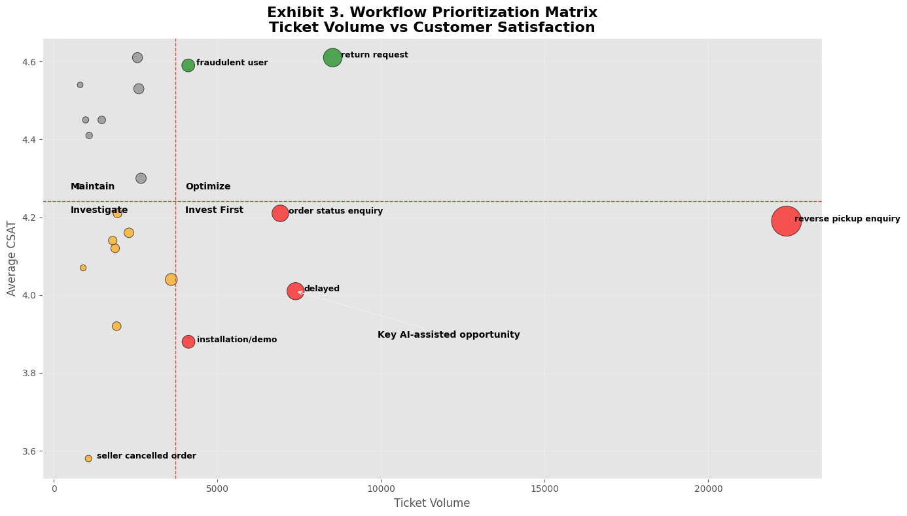
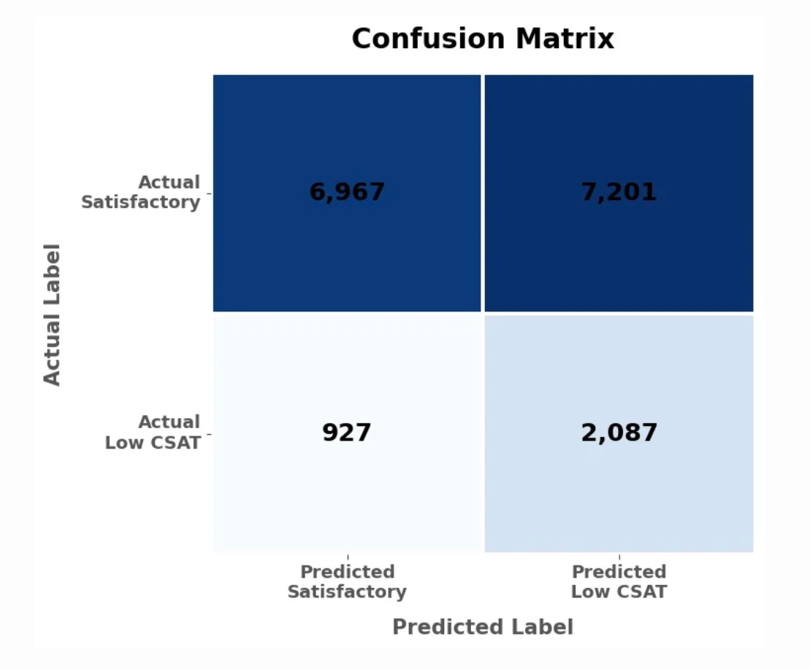

# Beyond the Ticket: Identifying High-Impact Generative AI Opportunities in Customer Support

## Project Overview

This project develops a business analytics framework for identifying where Generative AI can deliver the greatest operational value within Flipkart's customer support organization.

Rather than asking whether AI should replace customer support agents, the project identifies **which workflows should be fully automated, which should be AI-assisted, and which should remain human-led** based on operational characteristics, customer satisfaction, and business risk.

Using approximately **85,000 customer support interactions**, the analysis combines descriptive analytics, workflow intelligence, machine learning, and Explainable AI (SHAP) to produce a practical roadmap for strategic AI implementation.

---

## Business Problem

Many organizations deploy Generative AI uniformly across customer support operations without considering that different workflows vary significantly in:

- Operational complexity
- Business risk
- Required human judgment
- Automation potential

This project develops a workflow-centric framework to help organizations prioritize AI investments where they can create the greatest operational impact.

---

## Objectives

- Analyze customer support demand across operational workflows
- Identify workflows associated with poor customer satisfaction
- Develop a structured AI Workflow Prioritization Framework
- Validate analytical findings using machine learning
- Explain model predictions using SHAP
- Produce practical recommendations for Generative AI adoption

---

## Methodology

The project followed an end-to-end business analytics workflow:

1. Data Quality Assessment
2. Exploratory Data Analysis
3. Workflow-Level Operational Analysis
4. Customer Satisfaction Analysis
5. AI Workflow Prioritization
6. Machine Learning Validation (LightGBM)
7. Explainable AI using SHAP
8. Strategic Business Recommendations

### Workflow Prioritization

  

### Machine Learning Validation

  

---

## Key Findings

- Customer support demand is concentrated within a relatively small number of operational workflows.
- High ticket volume does not necessarily correspond to poor customer satisfaction.
- Workflow prioritization should consider both operational demand and customer experience.
- Operational characteristics contain meaningful predictive information for customer satisfaction.
- The greatest opportunity for Generative AI lies in augmenting operational workflows rather than replacing customer support agents.

---

## Technologies Used

- Python
- Pandas
- NumPy
- Matplotlib
- Scikit-learn
- LightGBM
- SHAP

---

## Repository Contents

| File | Description |
|------|-------------|
| Flipkart_GenAI_Project.ipynb | Complete notebook containing data preparation, exploratory analysis, machine learning, SHAP analysis, and visualizations |
| Flipkart_GenAI_Project_Report.pdf | Comprehensive technical project report |
| Flipkart_GenAI_Summary_Report.pdf | Executive summary of the project |
| Flipkart_GenAI_Presentation.pdf | Executive presentation summarizing key findings and recommendations |

---

## Project Deliverables

- Business Analytics Report
- Executive Summary
- Executive Presentation
- Jupyter Notebook

---

## Future Work

Potential extensions include:

- Validation using post-deployment operational data
- Integration of response time and handling time metrics
- Deployment and A/B testing of AI-assisted workflows
- Incorporation of richer textual customer feedback for NLP analysis

---

## Author

**Syed Bilal Farrukh**

MS Business Analytics & Information Management  
Purdue University
